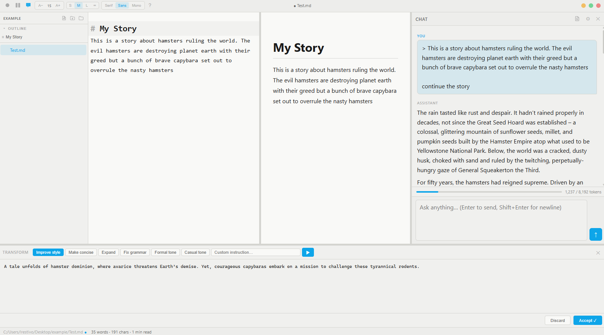
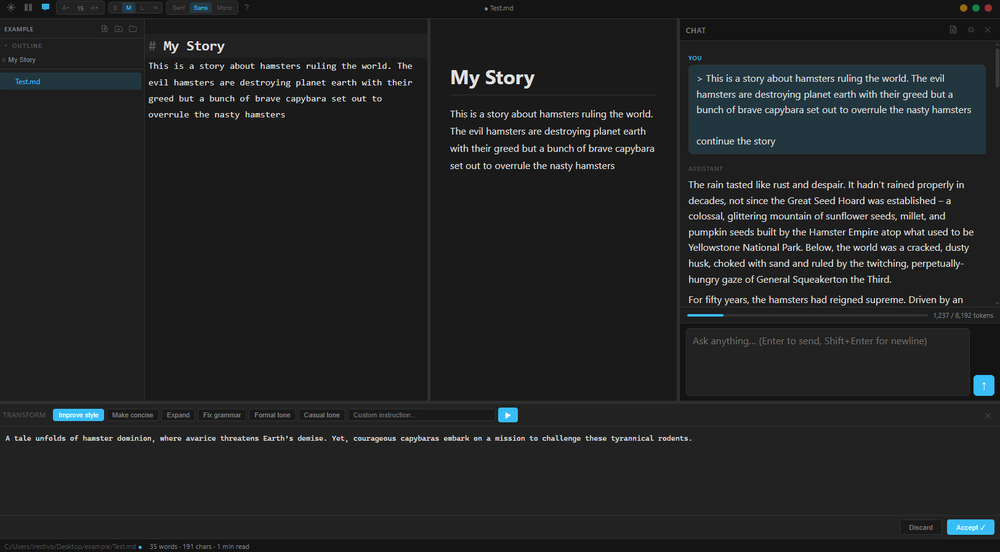

# Helium Reader

A Ghost-inspired markdown editor for Windows 11, built with Tauri 2 + Rust + React 19. Integrates Local LLM as writing assistant.




---

## Dependencies

**Runtime**
- [Node.js](https://nodejs.org) 18+ and npm
- [Rust](https://rustup.rs) (stable toolchain via `rustup`)
- **Microsoft C++ Build Tools** — required by Rust on Windows. Download from [visualstudio.microsoft.com/visual-cpp-build-tools](https://visualstudio.microsoft.com/visual-cpp-build-tools/) and select the **Desktop development with C++** workload.

**Optional** — for AI chat features
- [LM Studio](https://lmstudio.ai) running locally (default: `http://localhost:1234`)

---

## Setup

```
npm install
```

---

## Run (development)

```
npm run tauri dev
```

Starts the Vite dev server and compiles the Rust backend. The first build takes 3–5 minutes while Rust downloads and compiles all crates. Subsequent runs are fast (incremental).

---

## Build (production installer)

```
npm run tauri build
```

Produces an NSIS installer at:

```
src-tauri/target/release/bundle/nsis/Helium Reader_1.0.0_x64-setup.exe
```

---

## How to use

### Opening files

1. Click **Open Folder** (or `Ctrl+Shift+O`) to select a folder — the sidebar shows all `.md` files inside it.
2. Click any file to open it in the editor.
3. Right-click a file for **Rename**, **Delete** (Recycle Bin), or **Show in File Explorer**.

### Writing

The left pane is a full markdown editor. Toggle the preview pane with `Ctrl+\`.

| Action | Shortcut |
|---|---|
| Save | `Ctrl+S` |
| Save As | `Ctrl+Shift+S` |
| New file | `Ctrl+N` |
| Toggle sidebar | `Ctrl+B` |
| Toggle preview | `Ctrl+\` |
| Focus mode (fullscreen) | `F11` |
| Keyboard shortcuts overlay | `?` |

### Document outline

When a file is open, the **Outline** section at the top of the sidebar lists all headings (H1–H6). Click any heading to scroll both the preview pane and the editor to that section. Click **▾ Outline** to collapse or expand the panel.

### AI chat (LM Studio)

Open the chat panel with `Ctrl+Shift+L`. Requires LM Studio running locally.

- **Settings (⚙)** — set the API URL, model name, system prompt, and context window size.
- **Selection as context** — select text in the editor before sending a message; it is automatically included as a block-quoted context.
- **Full document as context** — click the **📄** button in the chat header to include the entire document as a system message with every send.
- `Enter` sends, `Shift+Enter` adds a newline, `Esc` aborts a stream.

### AI text transform

Select text in the editor, then press `Ctrl+Shift+T` to open the transform panel at the bottom of the window. Choose a preset (Improve style, Make concise, Expand, Fix grammar, Formal tone, Casual tone) or type a custom instruction. The result streams in — click **Accept** to replace the selection, **Discard** to keep the original.

### Keyboard shortcuts at a glance

Press **`?`** anywhere outside the editor to open the full shortcuts overlay, or click the **?** button in the title bar.
